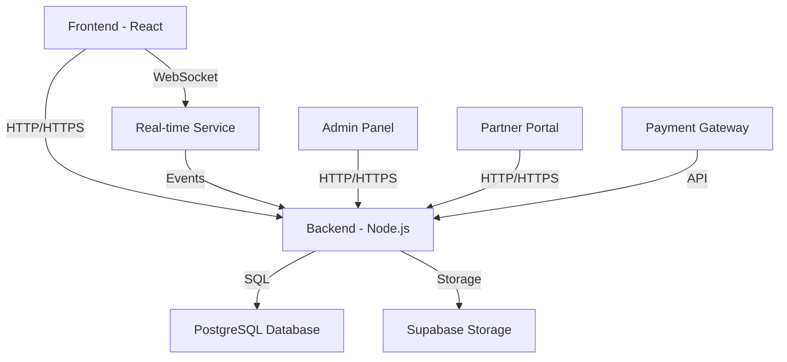
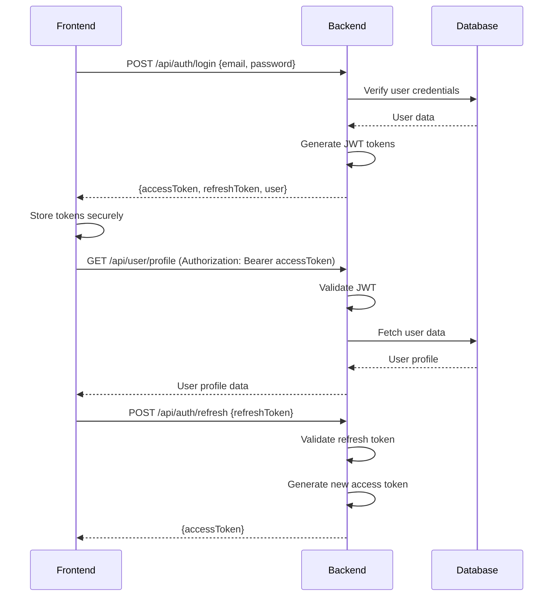
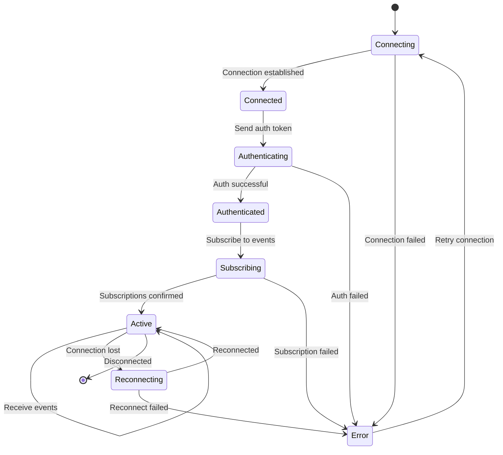
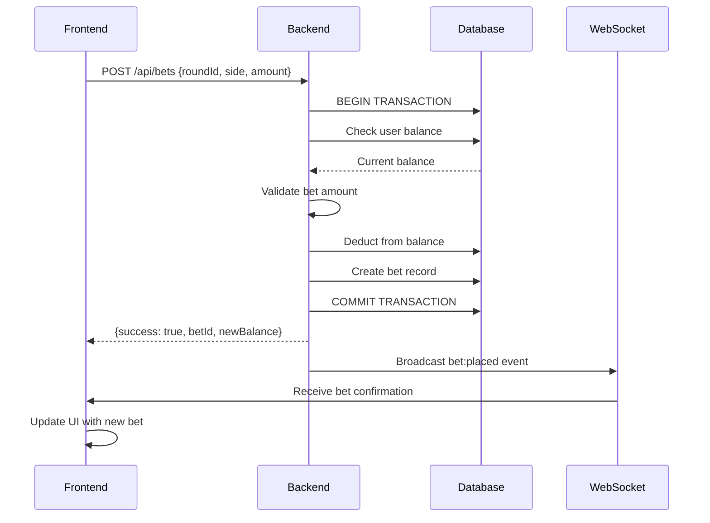
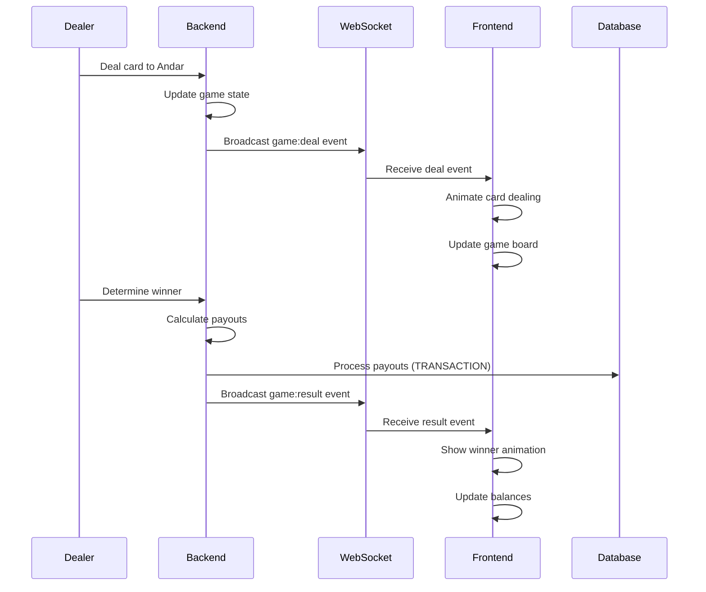
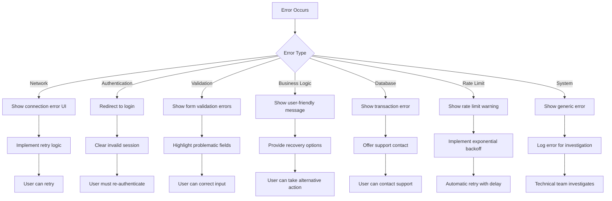

# Reddy Anna Gaming Platform - Backend-Frontend Integration Documentation

## Table of Contents
1. [Integration Overview](#integration-overview)
2. [API Architecture](#api-architecture)
3. [Authentication Flow](#authentication-flow)
4. [Real-time Communication](#real-time-communication)
5. [Data Flow Diagrams](#data-flow-diagrams)
6. [Key Integration Points](#key-integration-points)
7. [Error Handling Strategy](#error-handling-strategy)
8. [Performance Considerations](#performance-considerations)
9. [Security Integration](#security-integration)
10. [Testing Strategy](#testing-strategy)

## Integration Overview

The Reddy Anna Gaming Platform features a robust integration between frontend and backend components, enabling real-time gaming experiences with secure financial transactions and comprehensive management capabilities.

### Integration Architecture



### Key Integration Components

| Component | Technology | Responsibility |
|-----------|------------|----------------|
| Frontend | React, TypeScript | User interface, state management, routing |
| Backend | Node.js, Express | API endpoints, business logic, authentication |
| Real-time | WebSocket | Live game updates, notifications |
| Database | PostgreSQL | Data persistence, transactions |
| Storage | Supabase | File storage, media assets |
| Auth | JWT | Secure authentication and authorization |

## API Architecture

### RESTful API Structure

```markdown
📁 API Endpoints Structure
├── /api/auth          # Authentication endpoints
├── /api/users         # User management
├── /api/games         # Game operations
├── /api/bets          # Bet management
├── /api/transactions  # Financial transactions
├── /api/partners      # Partner management
├── /api/notifications # Notification system
├── /api/admin         # Admin-specific endpoints
├── /api/stream        # Stream configuration
```

### API Versioning Strategy

```markdown
📊 API Versioning
- Current Version: v1
- Versioning Strategy: URL-based (/api/v1/...)
- Backward Compatibility: Maintained for major versions
- Deprecation Policy: 6-month notice for major changes
```

### Request/Response Format

```typescript
// Standard Request Format
interface ApiRequest {
  headers: {
    Authorization: `Bearer ${string}`;
    'Content-Type': 'application/json';
    'X-Request-ID': string;
  };
  body: any;
  params: Record<string, string>;
  query: Record<string, string>;
}

// Standard Response Format
interface ApiResponse<T> {
  success: boolean;
  data?: T;
  error?: {
    code: string;
    message: string;
    details?: any;
  };
  meta?: {
    timestamp: string;
    version: string;
    requestId: string;
  };
}
```

## Authentication Flow

### JWT Authentication Process



### Role-Based Access Control

```markdown
🔐 Role-Based Access Control
- Roles: player, admin, partner
- Implementation: JWT claims + backend validation
- Admin Routes: Require 'admin' role
- Partner Routes: Require 'partner' role
- Game Routes: Require authenticated user
```

### Token Management

```markdown
🔑 Token Management
- Access Token: Short-lived (15-30 minutes)
- Refresh Token: Long-lived (7-30 days)
- Storage: HttpOnly cookies for refresh tokens
- Rotation: Refresh tokens rotated on use
- Revocation: Server-side token blacklist
```

## Real-time Communication

### WebSocket Integration

```markdown
🔌 WebSocket Integration Points
- Game State Updates: Real-time game progress
- Bet Placement: Instant bet confirmation
- Card Dealing: Live card reveal animations
- Game Results: Immediate win/loss notification
- System Notifications: Admin alerts and messages
- User Notifications: Personalized updates
```

### WebSocket Event Structure

```typescript
interface WebSocketEvent {
  event: string; // Event type
  data: any;     // Event payload
  timestamp: string;
  requestId?: string;
}

// Example Events
type GameEvents =
  | { event: 'game:join', data: { gameId: string; userId: string } }
  | { event: 'game:bet', data: { betId: string; amount: number; side: 'andar' | 'bahar' } }
  | { event: 'game:deal', data: { card: Card; side: 'andar' | 'bahar'; position: number } }
  | { event: 'game:result', data: { winner: 'andar' | 'bahar'; payouts: Payout[] } }
  | { event: 'game:round', data: { roundNumber: number; status: 'betting' | 'dealing' | 'complete' } };
```

### WebSocket Connection Lifecycle



## Data Flow Diagrams

### Game Bet Placement Flow



### Real-time Game Update Flow



## Key Integration Points

### 1. Authentication Integration

```markdown
🔐 Authentication Integration Points
- Login/Signup: Frontend forms → Backend validation → JWT issuance
- Token Storage: Secure cookie storage with HttpOnly flags
- Token Refresh: Automatic refresh before access token expiration
- Role Handling: Frontend routing based on JWT claims
- Session Management: Backend session tracking and validation
```

### 2. Game State Management

```markdown
🎮 Game State Integration
- Initial Load: Frontend fetches current game state from API
- Real-time Updates: WebSocket provides live game progress
- State Synchronization: Frontend reconciles API + WebSocket data
- Error Recovery: Automatic reconnection and state recovery
- History Tracking: Frontend maintains local game history
```

### 3. Financial Transactions

```markdown
💰 Financial Transaction Integration
- Balance Updates: Real-time balance synchronization
- Bet Processing: Atomic transaction processing
- Payout Handling: Automatic payout distribution
- Transaction History: Comprehensive transaction logging
- Error Handling: Transaction rollback on failures
```

### 4. Admin Functionality

```markdown
📊 Admin Integration Points
- User Management: CRUD operations with real-time updates
- Game Control: Manual game intervention capabilities
- Financial Oversight: Transaction monitoring and management
- Reporting: Data export and visualization
- System Configuration: Settings management
```

### 5. Notification System

```markdown
🔔 Notification Integration
- Real-time Alerts: WebSocket-based instant notifications
- Notification Center: Frontend notification management
- Priority Handling: Visual distinction for urgent notifications
- Dismissal Tracking: Backend notification status updates
- History: Comprehensive notification logging
```

## Error Handling Strategy

### Error Classification

```markdown
❌ Error Classification System
- Network Errors: Connection issues, timeouts
- Authentication Errors: Invalid tokens, expired sessions
- Validation Errors: Invalid input data
- Business Logic Errors: Invalid game states, insufficient funds
- Database Errors: Transaction failures, constraints
- Rate Limit Errors: Too many requests
- System Errors: Server errors, unexpected conditions
```

### Error Handling Flow



### Error Recovery Patterns

```markdown
🔄 Error Recovery Strategies
- Automatic Retry: For transient network errors
- Exponential Backoff: For rate-limited operations
- Fallback UI: Graceful degradation on failures
- State Recovery: Restore previous valid state
- User Guidance: Clear instructions for recovery
- Support Contact: Easy access to help resources
```

## Performance Considerations

### Performance Optimization Strategies

```markdown
⚡ Performance Integration Points
- Data Fetching: Efficient API calls with proper caching
- Real-time Updates: Optimized WebSocket message handling
- Rendering: Virtualization for large datasets
- State Management: Selective updates to minimize re-renders
- Network: Compression and efficient data formats
- Memory: Proper cleanup and leak prevention
```

### Performance Monitoring

```markdown
📊 Performance Metrics
- API Response Times: Monitor and optimize slow endpoints
- WebSocket Latency: Track real-time message delivery
- Frontend Rendering: Monitor frame rates and jank
- Memory Usage: Track memory consumption patterns
- Network Usage: Monitor data transfer volumes
- Error Rates: Track frequency of various error types
```

## Security Integration

### Security Measures

```markdown
🔒 Security Integration Points
- Authentication: Secure JWT implementation
- Authorization: Role-based access control
- Data Validation: Comprehensive input validation
- Rate Limiting: Protection against abuse
- CORS: Proper cross-origin resource sharing
- CSRF: Protection against cross-site request forgery
- XSS: Protection against cross-site scripting
- Logging: Comprehensive security logging
- Monitoring: Real-time security monitoring
```

### Security Headers

```markdown
🛡️ Security Headers
- Content-Security-Policy: Restrict resource loading
- Strict-Transport-Security: Enforce HTTPS
- X-Content-Type-Options: Prevent MIME sniffing
- X-Frame-Options: Prevent clickjacking
- X-XSS-Protection: Enable XSS protection
- Referrer-Policy: Control referrer information
- Permissions-Policy: Control browser features
```

## Testing Strategy

### Integration Testing Approach

```markdown
🧪 Integration Testing Strategy
- API Contract Testing: Verify API responses match specifications
- WebSocket Testing: Verify real-time message handling
- Authentication Testing: Verify JWT flow and security
- Error Handling Testing: Verify proper error responses
- Performance Testing: Verify response times under load
- Security Testing: Verify protection against common vulnerabilities
```

### Test Coverage Goals

```markdown
📊 Test Coverage Targets
- API Endpoints: 95% coverage
- WebSocket Events: 90% coverage
- Authentication Flow: 100% coverage
- Error Handling: 90% coverage
- Security Measures: 100% coverage
- Performance: Baseline + regression testing
```

### Test Automation

```markdown
🤖 Test Automation Plan
- CI/CD Integration: Automated test execution
- Regression Testing: Automated regression suite
- Performance Monitoring: Continuous performance tracking
- Security Scanning: Automated vulnerability scanning
- End-to-End Testing: Comprehensive user flow testing
```

## Deployment Strategy

### Deployment Integration Points

```markdown
🚀 Deployment Considerations
- Environment Configuration: Proper environment variables
- Feature Flags: Gradual feature rollout
- Monitoring Integration: Performance and error tracking
- Logging Configuration: Comprehensive logging setup
- Security Configuration: Proper security headers and settings
- Database Migrations: Safe schema updates
```

### Rollback Strategy

```markdown
🔙 Rollback Plan
- Versioned Deployments: Easy rollback to previous versions
- Feature Flag Rollback: Quick feature disabling
- Database Rollback: Safe transaction rollback
- Configuration Rollback: Previous configuration restoration
- Monitoring During Rollback: Verify system stability
```

## Monitoring and Maintenance

### Integration Monitoring

```markdown
📊 Monitoring Integration Points
- API Performance: Response times and error rates
- WebSocket Performance: Message delivery and latency
- Frontend Performance: Rendering times and memory usage
- Authentication: Login success/failure rates
- Financial Transactions: Transaction success rates
- Error Tracking: Comprehensive error logging
- User Activity: Usage patterns and engagement
```

### Maintenance Integration

```markdown
🔧 Maintenance Considerations
- Logging: Comprehensive system logging
- Alerting: Real-time issue notification
- Documentation: Up-to-date integration documentation
- Dependency Management: Regular updates and security patches
- Performance Tuning: Continuous optimization
- User Feedback: Collection and analysis system
```

## Conclusion

This comprehensive backend-frontend integration documentation provides a complete overview of how the Reddy Anna Gaming Platform's components work together to deliver a seamless gaming experience. The documentation covers all critical integration points, from authentication and real-time communication to financial transactions and administrative functions.

The integration strategy ensures:
- **Secure communication** between all components
- **Real-time updates** for an engaging gaming experience
- **Reliable financial transactions** with proper validation
- **Comprehensive error handling** for robust operation
- **Performance optimization** for smooth user experience
- **Scalable architecture** for future growth

This documentation serves as a complete reference for understanding the system's integration points and provides guidance for maintaining and extending the platform's capabilities.