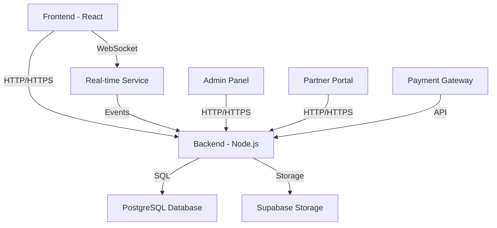

# Reddy Anna Gaming Platform - Complete System Documentation

## Table of Contents
1. [System Overview](#system-overview)
2. [Architecture Diagram](#architecture-diagram)
3. [Frontend Components](#frontend-components)
4. [Backend Services](#backend-services)
5. [Database Schema](#database-schema)
6. [Real-time Communication](#real-time-communication)
7. [Security Implementation](#security-implementation)
8. [Game Logic](#game-logic)
9. [Financial Transactions](#financial-transactions)
10. [Admin Features](#admin-features)
11. [Partner System](#partner-system)
12. [Current System Status](#current-system-status)
13. [Areas for Improvement](#areas-for-improvement)
14. [Action Plan](#action-plan)

## System Overview

The Reddy Anna Gaming Platform is a comprehensive online gaming system featuring Andar Bahar with real-time multiplayer functionality, secure financial transactions, and robust admin management capabilities.

### Key Features:
- ✅ Real-time Andar Bahar gaming with live dealers
- ✅ Secure user authentication and authorization
- ✅ Comprehensive financial transaction system
- ✅ Admin dashboard with full management capabilities
- ✅ Partner referral and commission system
- ✅ Responsive frontend with mobile-first design
- ✅ Real-time notifications and updates
- ✅ Comprehensive logging and auditing

## Architecture Diagram

## Frontend Components

### Core Structure
- **Main App**: [`App.tsx`](frontend/src/App.tsx:1) - Central routing and state management
- **Authentication**: JWT-based with role differentiation (player/admin/partner)
- **State Management**: Zustand stores for game state, auth, and notifications
- **Routing**: Wouter for client-side navigation

### Key Pages
1. **Public Pages**:
   - Landing Page with marketing content
   - Authentication flows (login/signup)
   - Role-specific login pages

2. **Player Pages**:
   - Game Room with real-time betting
   - Dashboard with account overview
   - Wallet and transaction management
   - Bonus and referral system
   - Game history and analytics

3. **Admin Pages**:
   - Comprehensive dashboard with metrics
   - User management interface
   - Game control panel
   - Financial transaction management
   - Partner management
   - System settings and configuration

4. **Partner Pages**:
   - Partner dashboard
   - Player management
   - Commission tracking
   - Withdrawal management

### Key Components
- **GameTable**: Animated card display with real-time updates
- **BettingPanel**: Real-time bet placement interface
- **AdminNotificationPanel**: Comprehensive notification system
- **WebSocketContext**: Real-time communication provider
- **AuthInitializer**: Authentication state management

## Backend Services

### Core Services
- **User Management**: Authentication, authorization, profile management
- **Game Service**: Andar Bahar game logic and round management
- **Bet Service**: Bet placement, validation, and payout processing
- **Financial Service**: Wallet management, deposits, withdrawals
- **Partner Service**: Partner management and commission tracking
- **Notification Service**: Real-time notification system
- **Stream Service**: Live stream configuration and management

### API Endpoints
- RESTful API for data operations
- WebSocket endpoints for real-time communication
- Admin-specific endpoints with role-based access control

## Database Schema

### Core Tables
- **users**: User accounts with authentication data
- **games**: Game sessions and rounds
- **bets**: Player bets with status tracking
- **transactions**: Financial transaction history
- **partners**: Partner accounts and relationships
- **notifications**: System notifications
- **game_history**: Complete game records
- **bonuses**: Bonus and referral tracking

### Key Relationships
- Users → Bets (1:N)
- Users → Transactions (1:N)
- Games → Bets (1:N)
- Partners → Users (1:N referral relationship)
- Users → Notifications (1:N)

## Real-time Communication

### WebSocket Implementation
- **Connection Management**: Automatic reconnection and status monitoring
- **Event System**: Structured event types for different operations
- **Game Events**: Real-time game state updates
- **Notification Events**: Instant notification delivery
- **Error Handling**: Comprehensive error recovery

### Event Types
- `game:join` - Player joins game
- `game:bet` - Bet placement
- `game:deal` - Card dealing
- `game:result` - Game result announcement
- `notification:new` - New notification
- `system:update` - System updates

## Security Implementation

### Authentication
- JWT-based authentication with refresh tokens
- Role-based access control (player/admin/partner)
- Secure password hashing

### Authorization
- Route protection based on user roles
- API endpoint authorization
- Admin-only functionality protection

### Data Protection
- Input validation and sanitization
- Rate limiting on critical endpoints
- Secure financial transaction processing
- Comprehensive logging and auditing

## Game Logic

### Andar Bahar Rules
- Standard Andar Bahar rules implementation
- Proper joker card selection
- Correct card dealing sequence
- Accurate win/loss determination
- Proper payout calculations (1:1 odds)

### Game Flow
1. **Betting Phase**: Players place bets on Andar or Bahar
2. **Dealing Phase**: Cards are dealt to determine winner
3. **Result Phase**: Winners are determined and payouts processed
4. **Transition**: New round begins automatically

## Financial Transactions

### Transaction Safety
- Atomic database operations for financial integrity
- Comprehensive validation before processing
- Detailed transaction logging
- Audit trails for all financial operations

### Transaction Types
- Deposits (manual and automatic)
- Withdrawals (with approval workflow)
- Bets (with status tracking)
- Payouts (automatic on win)
- Bonuses (referral and promotional)
- Commissions (partner earnings)

## Admin Features

### Dashboard
- Real-time metrics and statistics
- System health monitoring
- Quick access to all management features

### Management Capabilities
- User management (CRUD operations)
- Game control (manual intervention)
- Financial transaction management
- Partner management
- System configuration
- Stream settings management

### Monitoring
- Real-time activity monitoring
- Comprehensive logging
- Notification system
- Alerting for critical events

## Partner System

### Partner Features
- Player referral tracking
- Commission calculation
- Withdrawal management
- Performance analytics
- Dedicated partner portal

### Commission Structure
- Configurable commission rates
- Automatic calculation
- Transparent reporting
- Withdrawal processing

## Current System Status

### ✅ Working Components
- Complete Andar Bahar game implementation
- Secure authentication and authorization
- Real-time WebSocket communication
- Comprehensive admin panel
- Partner referral system
- Financial transaction processing
- Responsive frontend design
- Mobile-first approach
- Error handling and recovery
- Notification system
- Logging and auditing

### ⚠️ Areas Needing Attention

1. **Frontend Improvements**:
   - Mobile responsiveness fine-tuning
   - Performance optimization for large user loads
   - Accessibility improvements
   - Theme consistency across all pages
   - Loading state improvements

2. **Game Interface**:
   - Enhanced card animation effects
   - Improved betting UI/UX
   - Better visual feedback for game events
   - Sound effects integration
   - Chat system for player interaction

3. **Admin Dashboard**:
   - Advanced filtering and search
   - Export functionality for reports
   - Enhanced visualization of metrics
   - Bulk operations support
   - Audit log viewing

4. **Technical Debt**:
   - Code documentation completion
   - TypeScript type coverage improvement
   - Error handling consistency
   - Test coverage expansion
   - Dependency updates

## Areas for Improvement

### 1. Frontend Enhancements

**Game Interface**:
- Add sound effects for game events (card dealing, wins, etc.)
- Implement chat system for player interaction
- Enhance card animation with more realistic physics
- Add visual effects for big wins
- Improve mobile betting interface

**Admin Dashboard**:
- Add data export functionality (CSV/Excel)
- Implement advanced filtering and search
- Add more visualization charts and graphs
- Support bulk user operations
- Add comprehensive audit log viewing

**User Experience**:
- Improve loading states and transitions
- Add tutorial for new players
- Implement game history visualization
- Add achievement system
- Enhance notification system with more options

### 2. Backend Improvements

**Performance**:
- Implement caching for frequently accessed data
- Add database indexing optimization
- Implement query optimization
- Add load balancing support
- Implement rate limiting improvements

**Security**:
- Add two-factor authentication
- Implement IP whitelisting for admin access
- Add comprehensive security logging
- Implement automated security scanning
- Add DDoS protection

**Reliability**:
- Implement comprehensive error monitoring
- Add automated recovery procedures
- Implement database backup system
- Add failover support
- Implement health monitoring

### 3. Technical Improvements

**Code Quality**:
- Complete comprehensive code documentation
- Improve TypeScript type coverage
- Implement consistent error handling patterns
- Add comprehensive logging
- Implement code style consistency

**Testing**:
- Expand unit test coverage
- Implement integration testing
- Add end-to-end testing
- Implement performance testing
- Add security testing

**Deployment**:
- Implement CI/CD pipeline
- Add automated testing in pipeline
- Implement blue-green deployment
- Add rollback capabilities
- Implement monitoring integration

## Action Plan

### Phase 1: Frontend Improvements (2-3 weeks)

1. **Game Interface Enhancements**:
   - Add sound effects system
   - Implement player chat functionality
   - Enhance card animations
   - Add win celebration effects
   - Improve mobile betting UI

2. **Admin Dashboard Upgrades**:
   - Add data export functionality
   - Implement advanced filtering
   - Add more visualization options
   - Support bulk operations
   - Add audit log viewing

3. **User Experience Improvements**:
   - Enhance loading states
   - Add new player tutorial
   - Implement game history visualization
   - Add achievement system
   - Improve notifications

### Phase 2: Backend Optimization (2 weeks)

1. **Performance Improvements**:
   - Implement caching strategy
   - Add database indexing
   - Optimize queries
   - Add load balancing
   - Implement rate limiting

2. **Security Enhancements**:
   - Add two-factor authentication
   - Implement IP whitelisting
   - Add security logging
   - Implement security scanning
   - Add DDoS protection

3. **Reliability Improvements**:
   - Implement error monitoring
   - Add recovery procedures
   - Implement backup system
   - Add failover support
   - Implement health monitoring

### Phase 3: Technical Excellence (1-2 weeks)

1. **Code Quality**:
   - Complete documentation
   - Improve TypeScript coverage
   - Standardize error handling
   - Add comprehensive logging
   - Ensure code style consistency

2. **Testing**:
   - Expand unit test coverage
   - Implement integration tests
   - Add end-to-end tests
   - Implement performance tests
   - Add security tests

3. **Deployment**:
   - Implement CI/CD pipeline
   - Add automated testing
   - Implement deployment strategy
   - Add rollback capabilities
   - Integrate monitoring

### Phase 4: Launch Preparation (1 week)

1. **Final Testing**:
   - Comprehensive system testing
   - Performance load testing
   - Security penetration testing
   - User acceptance testing
   - Regression testing

2. **Deployment Planning**:
   - Finalize deployment strategy
   - Prepare rollback plan
   - Set up monitoring and alerting
   - Prepare documentation
   - Train support staff

3. **Launch**:
   - Gradual rollout strategy
   - Monitor system performance
   - Quick response to issues
   - Collect user feedback
   - Plan post-launch improvements

## Documentation Plan

### 1. Technical Documentation
- Complete API documentation
- Database schema documentation
- System architecture diagrams
- Deployment instructions
- Configuration guide

### 2. User Documentation
- Player guide and tutorial
- Admin manual
- Partner guide
- FAQ and troubleshooting
- Terms and conditions

### 3. Development Documentation
- Code style guide
- Contribution guidelines
- Testing strategy
- Release process
- Versioning strategy

## Testing Strategy

### Test Coverage Goals
- 90% unit test coverage
- 80% integration test coverage
- Comprehensive end-to-end tests
- Performance benchmarks
- Security testing

### Test Types
- Unit tests (Jest)
- Integration tests
- End-to-end tests (Cypress)
- Performance tests
- Security tests
- User acceptance tests

### Test Automation
- CI/CD pipeline integration
- Automated test execution
- Test result reporting
- Test coverage monitoring
- Regression test suite

## Deployment Strategy

### Deployment Phases
1. **Staging Deployment**:
   - Deploy to staging environment
   - Perform comprehensive testing
   - Validate all functionality
   - Test performance under load
   - Verify security measures

2. **Production Deployment**:
   - Gradual rollout to production
   - Monitor system metrics
   - Quick rollback capability
   - User feedback collection
   - Continuous monitoring

### Deployment Methods
- Blue-green deployment
- Canary releases
- Feature flags
- Automated rollback
- Health monitoring

### Post-Deployment
- Performance monitoring
- Error tracking
- User feedback analysis
- Continuous improvement
- Regular updates

## Monitoring and Maintenance

### Monitoring System
- Real-time performance monitoring
- Error tracking and alerting
- User activity monitoring
- System health checks
- Security monitoring

### Maintenance Plan
- Regular system updates
- Security patch management
- Performance optimization
- Feature enhancements
- Bug fixes and improvements

### Support System
- User support channels
- Issue tracking system
- Knowledge base
- FAQ and documentation
- Community support

## Conclusion

The Reddy Anna Gaming Platform is a comprehensive and well-architected system that provides a solid foundation for online gaming. While the core functionality is complete and working, there are several areas for improvement that would enhance the user experience, system performance, and overall quality.

The proposed action plan provides a structured approach to addressing these improvements systematically, ensuring that the platform continues to evolve and meet the needs of players, administrators, and partners alike.

The documentation provided here serves as a complete reference for the current system state and a roadmap for future enhancements, ensuring that all stakeholders have a clear understanding of the platform's capabilities and the path forward for continuous improvement.