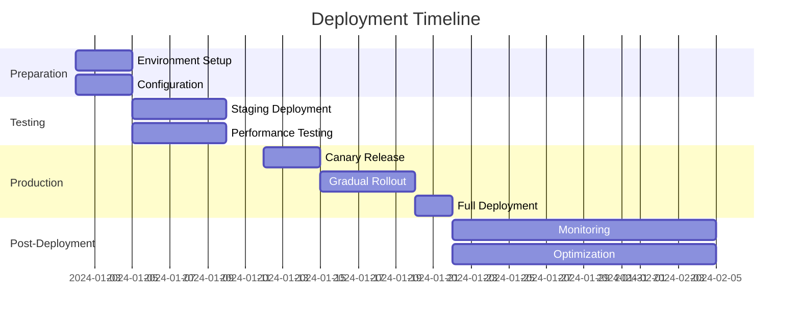
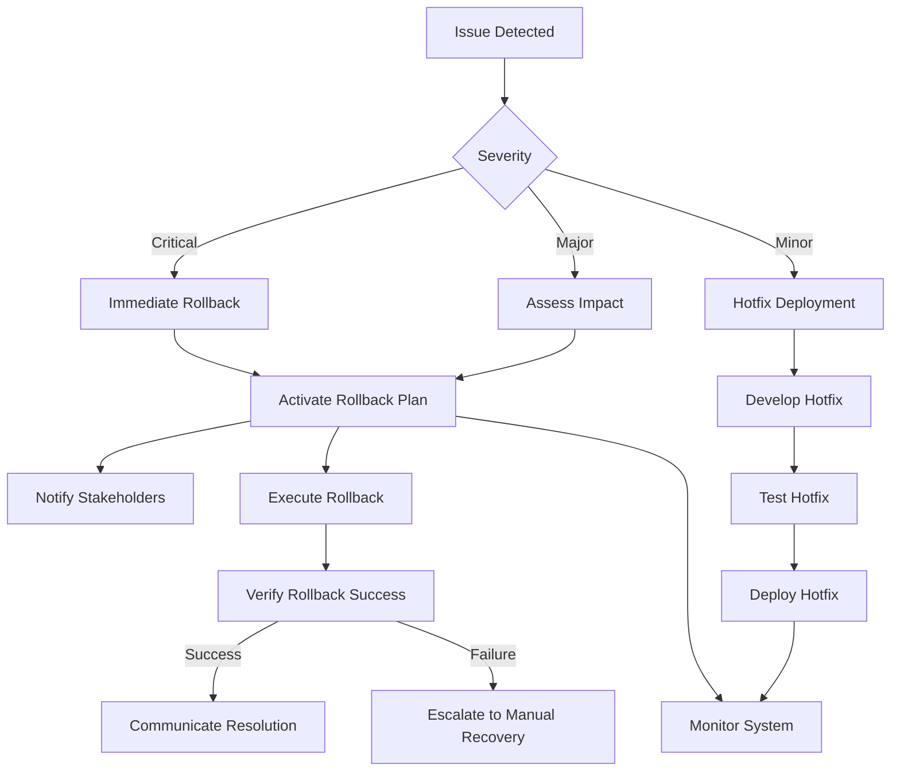

# Reddy Anna Gaming Platform - Deployment and Testing Strategy

## Table of Contents
1. [Deployment Strategy](#deployment-strategy)
2. [Testing Strategy](#testing-strategy)
3. [CI/CD Pipeline](#cicd-pipeline)
4. [Environment Configuration](#environment-configuration)
5. [Monitoring and Alerting](#monitoring-and-alerting)
6. [Rollback Strategy](#rollback-strategy)
7. [Security Considerations](#security-considerations)
8. [Performance Optimization](#performance-optimization)
9. [User Acceptance Testing](#user-acceptance-testing)
10. [Post-Deployment Plan](#post-deployment-plan)

## Deployment Strategy

### Deployment Overview

The deployment strategy for the Reddy Anna Gaming Platform is designed to ensure a smooth, reliable transition from development to production while minimizing risk and ensuring system stability.

### Deployment Phases



### Deployment Methods

| Method | Description | Use Case |
|--------|-------------|----------|
| **Blue-Green** | Maintain two identical production environments | Major version updates |
| **Canary** | Gradual rollout to small user groups | New feature testing |
| **Feature Flags** | Toggle features on/off without deployment | Experimental features |
| **Rolling Updates** | Gradual replacement of instances | Minor updates and patches |
| **A/B Testing** | Compare different versions | UI/UX improvements |

### Deployment Checklist

```markdown
📋 Pre-Deployment Checklist
- [ ] All tests passing in staging
- [ ] Performance benchmarks met
- [ ] Security audit completed
- [ ] Database migrations tested
- [ ] Configuration validated
- [ ] Monitoring configured
- [ ] Rollback plan prepared
- [ ] Team availability confirmed
- [ ] Communication plan ready
```

## Testing Strategy

### Comprehensive Testing Approach

```markdown
🧪 Testing Pyramid
        /\
       /  \
      /    \       E2E Tests (10-15%)
     /      \
    /        \     Integration Tests (20-25%)
   /          \
  /            \   Unit Tests (60-70%)
 /______________\
```

### Test Coverage Goals

| Test Type | Coverage Goal | Responsibility |
|-----------|---------------|----------------|
| Unit Tests | 85-90% | Developers |
| Integration Tests | 75-80% | QA Team |
| End-to-End Tests | 80% of critical flows | QA Team |
| Performance Tests | Baseline + regression | Performance Team |
| Security Tests | 100% of OWASP Top 10 | Security Team |
| Accessibility Tests | 100% WCAG 2.1 AA | QA Team |
| Cross-Browser Tests | All supported browsers | QA Team |

### Test Automation Strategy

```markdown
🤖 Test Automation Plan
- Unit Tests: Jest (automated in CI)
- Integration Tests: Supertest + custom scripts
- E2E Tests: Cypress (automated in CI)
- Performance Tests: k6 + custom monitoring
- Security Tests: OWASP ZAP + manual review
- Accessibility: axe + manual testing
- Cross-Browser: BrowserStack automation
```

## CI/CD Pipeline

### Pipeline Architecture

```mermaid
graph LR
    A[Code Commit] --> B[Linting]
    B --> C[Unit Tests]
    C --> D[Build]
    D --> E[Integration Tests]
    E --> F[Staging Deployment]
    F --> G[E2E Tests]
    G --> H[Performance Tests]
    H --> I[Security Scan]
    I --> J[Approval Gate]
    J --> K[Production Deployment]
    K --> L[Smoke Tests]
    L --> M[Monitoring]
```



### Pipeline Stages

```markdown
🚀 CI/CD Pipeline Stages
1. **Code Quality**: Linting, formatting, static analysis
2. **Unit Testing**: Fast feedback on component level
3. **Build**: Optimized production build
4. **Integration Testing**: API and service interactions
5. **Staging Deployment**: Environment-specific deployment
6. **E2E Testing**: Complete user flow validation
7. **Performance Testing**: Load and stress testing
8. **Security Testing**: Vulnerability scanning
9. **Approval**: Manual review and sign-off
10. **Production Deployment**: Gradual rollout
11. **Smoke Testing**: Quick production validation
12. **Monitoring**: Continuous performance tracking
```

### Pipeline Tools

| Category | Tool | Purpose |
|----------|------|---------|
| Version Control | Git | Source code management |
| CI/CD | GitHub Actions | Pipeline execution |
| Testing | Jest, Cypress | Test automation |
| Performance | k6 | Load testing |
| Security | OWASP ZAP | Vulnerability scanning |
| Monitoring | Prometheus + Grafana | System monitoring |
| Logging | ELK Stack | Log aggregation |
| Deployment | Docker + Kubernetes | Container orchestration |
| Configuration | Terraform | Infrastructure as code |

## Environment Configuration

### Environment Strategy

```markdown
🌐 Environment Configuration
- Development: Local development with hot reloading
- Staging: Production-like environment for testing
- Production: Live environment with full monitoring
- Feature Branches: Isolated environments for new features
```

### Environment Variables

```markdown
🔑 Environment Variables Structure
- APP_ENV: development/staging/production
- DATABASE_URL: PostgreSQL connection string
- JWT_SECRET: JWT signing secret
- WEBSOCKET_URL: WebSocket server URL
- API_BASE_URL: API endpoint base URL
- STORAGE_URL: Supabase storage endpoint
- LOG_LEVEL: debug/info/warn/error
- RATE_LIMIT: Request rate limits
- FEATURE_FLAGS: Feature toggle configuration
```

### Configuration Management

```markdown
⚙️ Configuration Management
- Infrastructure as Code: Terraform for cloud resources
- Containerization: Docker for consistent environments
- Orchestration: Kubernetes for scaling
- Secrets Management: Vault for sensitive data
- Configuration Files: Environment-specific configs
- Feature Flags: Dynamic feature toggling
```

## Monitoring and Alerting

### Monitoring Strategy

```markdown
📊 Comprehensive Monitoring
- Performance Metrics: Response times, throughput
- Error Tracking: Error rates and patterns
- User Activity: Engagement and behavior
- System Health: Resource utilization
- Security Events: Suspicious activity
- Business Metrics: Key performance indicators
```

### Monitoring Tools

| Category | Tool | Metrics Tracked |
|----------|------|-----------------|
| Performance | Prometheus | Response times, request rates |
| Logging | ELK Stack | Application logs, error logs |
| APM | New Relic | Transaction tracing, performance |
| Error Tracking | Sentry | Error rates, stack traces |
| Infrastructure | Grafana | Server metrics, resource usage |
| Business | Custom | User engagement, financial metrics |
| Security | Custom | Login attempts, suspicious activity |

### Alerting Strategy

```markdown
🚨 Alerting Configuration
- Critical Errors: Immediate notification (SMS + Email)
- Performance Degradation: Warning threshold alerts
- Security Events: High-priority alerts
- Business Metrics: Threshold-based alerts
- System Health: Resource exhaustion warnings
```

## Rollback Strategy

### Rollback Plan

```markdown
🔙 Comprehensive Rollback Strategy
- Versioned Releases: Easy rollback to previous versions
- Feature Flags: Quick feature disabling
- Database Migrations: Safe rollback scripts
- Configuration Rollback: Previous configuration restoration
- Monitoring During Rollback: Verify system stability
- Communication Plan: Stakeholder notification
```

### Rollback Triggers

```markdown
⚠️ Rollback Conditions
- Critical bugs affecting core functionality
- Security vulnerabilities discovered
- Performance degradation beyond thresholds
- Data corruption or loss
- Major user experience issues
- Compliance violations
```

### Rollback Procedure



## Security Considerations

### Security Deployment Checklist

```markdown
🔒 Security Deployment Checklist
- [ ] All security patches applied
- [ ] Security headers configured
- [ ] Rate limiting enabled
- [ ] SSL/TLS properly configured
- [ ] Database encrypted
- [ ] Secrets properly managed
- [ ] Logging configured for security events
- [ ] Monitoring for suspicious activity
- [ ] Backup system verified
- [ ] Incident response plan ready
```

### Security Monitoring

```markdown
🛡️ Security Monitoring Points
- Authentication Attempts: Failed login tracking
- API Access: Unusual access patterns
- Data Access: Sensitive data access logging
- System Changes: Configuration change tracking
- Network Traffic: Anomaly detection
- User Behavior: Unusual activity patterns
```

## Performance Optimization

### Performance Deployment Strategy

```markdown
⚡ Performance Optimization Plan
- Database Indexing: Optimize query performance
- Caching Strategy: Implement multi-level caching
- Load Balancing: Distribute traffic effectively
- CDN Integration: Optimize static asset delivery
- Compression: Enable gzip/brotli compression
- Connection Pooling: Optimize database connections
- Query Optimization: Analyze and optimize slow queries
```

### Performance Benchmarks

```markdown
📊 Performance Targets
- API Response Time: < 200ms (95th percentile)
- Page Load Time: < 2s (90th percentile)
- WebSocket Latency: < 100ms (95th percentile)
- Database Query Time: < 50ms (95th percentile)
- Concurrent Users: 10,000+ with < 1s response
- Error Rate: < 0.1% of requests
- Uptime: 99.95% availability
```

## User Acceptance Testing

### UAT Strategy

```markdown
👥 User Acceptance Testing Plan
- Test Group: Representative user sample
- Test Duration: 2-4 weeks
- Test Environment: Production-like staging
- Feedback Collection: Surveys and interviews
- Issue Tracking: Dedicated UAT bug tracker
- Success Criteria: 90%+ satisfaction rate
```

### UAT Test Cases

```markdown
📋 UAT Test Case Categories
- Gameplay Experience: Andar Bahar game flow
- Financial Transactions: Deposits, withdrawals, bets
- User Interface: Navigation and usability
- Performance: Responsiveness and speed
- Mobile Experience: Cross-device functionality
- Admin Features: Management capabilities
- Partner Features: Partner portal functionality
- Error Handling: Recovery from issues
```

## Post-Deployment Plan

### Post-Deployment Activities

```markdown
🎯 Post-Deployment Checklist
- [ ] Monitor system performance
- [ ] Collect user feedback
- [ ] Address any issues promptly
- [ ] Optimize based on real usage
- [ ] Update documentation
- [ ] Train support staff
- [ ] Plan next iteration
```

### Continuous Improvement

```markdown
🔄 Continuous Improvement Plan
- Performance Monitoring: Track and optimize
- User Feedback: Regular collection and analysis
- Feature Enhancements: Prioritize based on usage
- Security Updates: Regular patching
- Technology Updates: Stay current
- Documentation Updates: Keep accurate
- Team Training: Continuous learning
```

## Deployment Timeline

### Detailed Deployment Schedule

```markdown
📅 Deployment Timeline
Week 1: Preparation
- Environment setup and configuration
- Final testing and validation
- Team training and readiness

Week 2: Staging Deployment
- Deploy to staging environment
- Comprehensive testing
- Performance benchmarking
- Security validation

Week 3: Production Rollout
- Canary release (5% of users)
- Monitor and validate
- Gradual rollout (25%, 50%, 100%)
- Final validation

Week 4-6: Post-Deployment
- Monitoring and optimization
- User feedback collection
- Issue resolution
- Documentation updates
- Planning next phase
```

## Risk Management

### Deployment Risks and Mitigation

| Risk | Impact | Likelihood | Mitigation Strategy |
|------|--------|------------|---------------------|
| Data Loss | Critical | Low | Comprehensive backups, rollback plan |
| Downtime | High | Medium | Blue-green deployment, health checks |
| Performance Issues | High | Medium | Load testing, performance monitoring |
| Security Vulnerabilities | Critical | Low | Security scanning, penetration testing |
| User Experience Issues | Medium | Medium | UAT, gradual rollout, feedback collection |
| Integration Problems | High | Low | Comprehensive integration testing |
| Configuration Errors | Medium | Medium | Automated configuration validation |
| Resource Exhaustion | High | Low | Load testing, auto-scaling configuration |

## Success Metrics

### Deployment Success Criteria

```markdown
🎯 Deployment Success Metrics
- System Availability: 99.95% uptime
- Performance: Meet all benchmarks
- Error Rate: < 0.1% of requests
- User Satisfaction: > 90% positive feedback
- Security: No critical vulnerabilities
- Financial Accuracy: 100% transaction accuracy
- Rollback Rate: < 5% of deployments
- Deployment Time: < 30 minutes for critical fixes
```

## Conclusion

This comprehensive deployment and testing strategy provides a robust framework for successfully launching and maintaining the Reddy Anna Gaming Platform. The strategy ensures:

1. **Reliable Deployments**: Through comprehensive testing and validation
2. **Minimal Risk**: With robust rollback capabilities and gradual rollout
3. **Optimal Performance**: Through continuous monitoring and optimization
4. **Security**: With comprehensive security measures and monitoring
5. **User Satisfaction**: Through thorough testing and feedback collection
6. **Continuous Improvement**: With ongoing monitoring and enhancement

By following this structured approach, the platform can achieve successful deployment while maintaining high quality, security, and user satisfaction throughout the process.