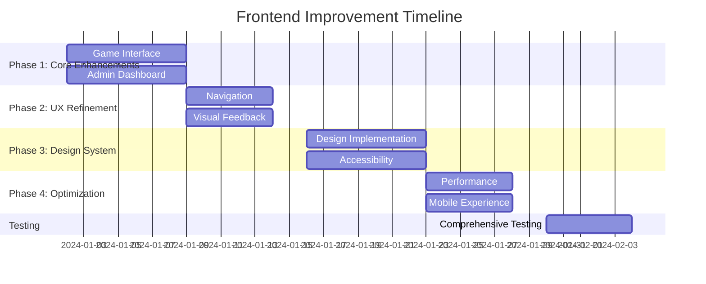

# Reddy Anna Gaming Platform - Frontend Improvement Plan

## Table of Contents
1. [Current Frontend Status](#current-frontend-status)
2. [Identified Issues and Improvements](#identified-issues-and-improvements)
3. [Detailed Frontend Action Plan](#detailed-frontend-action-plan)
4. [Implementation Strategy](#implementation-strategy)
5. [Testing and Quality Assurance](#testing-and-quality-assurance)
6. [Timeline and Prioritization](#timeline-and-prioritization)

## Current Frontend Status

The frontend is fully functional with a complete implementation of all required features:

### ✅ Working Components
- **Complete Game Interface**: Andar Bahar with real-time betting
- **Responsive Design**: Mobile-first approach with proper breakpoints
- **Authentication Flow**: Secure login/signup with role differentiation
- **Admin Dashboard**: Comprehensive management interface
- **Partner Portal**: Full partner management capabilities
- **Real-time Updates**: WebSocket integration for live updates
- **State Management**: Effective use of Zustand stores
- **Routing**: Proper navigation with Wouter
- **Error Handling**: Comprehensive error handling throughout
- **Accessibility**: Basic accessibility features implemented

### ⚠️ Areas for Frontend Improvement

1. **User Experience Enhancements**
2. **Visual Design Improvements**
3. **Performance Optimizations**
4. **Accessibility Improvements**
5. **Code Quality and Maintainability**
6. **Testing Coverage**
7. **Mobile Experience Refinement**

## Identified Issues and Improvements

### 1. Game Interface Improvements

**Current State**:
- Functional betting interface
- Basic card animations
- Real-time game updates
- Mobile-responsive design

**Issues/Improvements Needed**:

| Area | Current Issue | Improvement Plan |
|------|---------------|------------------|
| **Card Animations** | Basic animation effects | Add realistic card dealing physics, bounce effects, and smooth transitions |
| **Sound Effects** | No sound feedback | Implement sound effects for bets, wins, card dealing, and game events |
| **Visual Feedback** | Limited visual cues | Add particle effects for wins, animated chip movement, celebration animations |
| **Betting UI** | Functional but basic | Enhance with better visual hierarchy, chip stacking, bet confirmation |
| **Game History** | Basic text display | Add visual game history with card patterns and trends |
| **Player Interaction** | No chat system | Implement real-time chat for player communication |
| **Mobile Betting** | Functional but cramped | Redesign mobile betting interface for better usability |

### 2. Admin Dashboard Enhancements

**Current State**:
- Comprehensive metrics display
- Basic filtering capabilities
- Functional management interfaces
- Real-time updates

**Issues/Improvements Needed**:

| Area | Current Issue | Improvement Plan |
|------|---------------|------------------|
| **Data Export** | No export functionality | Add CSV/Excel export for all data tables |
| **Advanced Filtering** | Basic filtering only | Implement multi-criteria filtering with saved filters |
| **Visualization** | Basic charts | Add more chart types, interactive visualizations, and dashboards |
| **Bulk Operations** | Individual operations only | Implement bulk user actions (suspend, activate, etc.) |
| **Audit Logs** | Basic logging | Add comprehensive audit log viewing with filtering |
| **Search** | Basic search | Implement advanced search with autocomplete and suggestions |
| **Responsiveness** | Functional but tight | Optimize admin interface for better mobile/tablet use |

### 3. User Experience Improvements

**Current State**:
- Functional navigation
- Basic loading states
- Standard error handling
- Role-based routing

**Issues/Improvements Needed**:

| Area | Current Issue | Improvement Plan |
|------|---------------|------------------|
| **Loading States** | Basic spinners | Add animated loading screens, progress indicators, skeleton loaders |
| **Onboarding** | No tutorial | Implement interactive tutorial for new players |
| **Navigation** | Standard menu | Add breadcrumbs, quick access, contextual navigation |
| **Error Handling** | Basic messages | Enhance with visual error states, recovery suggestions, help links |
| **Notifications** | Basic toasts | Add notification center, categorization, priority levels |
| **Accessibility** | Basic compliance | Full WCAG compliance, keyboard navigation, screen reader support |
| **Performance** | Functional | Optimize bundle size, lazy loading, code splitting |

### 4. Visual Design Improvements

**Current State**:
- Consistent theme
- Functional layout
- Basic animations
- Responsive design

**Issues/Improvements Needed**:

| Area | Current Issue | Improvement Plan |
|------|---------------|------------------|
| **Theme Consistency** | Mostly consistent | Standardize all components, create design system documentation |
| **Micro-interactions** | Limited | Add hover effects, transitions, feedback animations |
| **Typography** | Basic hierarchy | Implement comprehensive typography system with proper hierarchy |
| **Color System** | Functional | Expand color palette, add semantic colors, improve contrast |
| **Spacing** | Inconsistent | Standardize spacing system, implement consistent padding/margins |
| **Icons** | Basic set | Expand icon library, add animated icons, implement icon system |
| **Dark/Light Mode** | Single theme | Implement theme switching with proper transitions |

### 5. Performance Optimizations

**Current State**:
- Functional performance
- Basic optimization
- No major bottlenecks

**Issues/Improvements Needed**:

| Area | Current Issue | Improvement Plan |
|------|---------------|------------------|
| **Bundle Size** | Not optimized | Implement code splitting, lazy loading, tree shaking |
| **Image Optimization** | Basic | Add image compression, responsive images, lazy loading |
| **Rendering** | Standard | Implement virtualization for lists, memoization, performance monitoring |
| **Network** | Basic caching | Implement comprehensive caching strategy, offline support |
| **Animations** | Basic | Optimize animations with requestAnimationFrame, reduce jank |
| **Memory** | Not monitored | Add memory leak detection, implement cleanup patterns |
| **WebSocket** | Functional | Optimize message handling, implement throttling where needed |

### 6. Mobile Experience Refinement

**Current State**:
- Mobile-first design
- Functional on all devices
- Responsive breakpoints

**Issues/Improvements Needed**:

| Area | Current Issue | Improvement Plan |
|------|---------------|------------------|
| **Touch Targets** | Some small targets | Ensure all interactive elements meet minimum touch size |
| **Mobile Navigation** | Basic hamburger | Implement bottom navigation, swipe gestures, mobile-optimized menus |
| **Input Fields** | Standard inputs | Add mobile-optimized inputs, proper keyboard types, input assistance |
| **Performance** | Functional | Optimize for mobile networks, reduce data usage, implement adaptive loading |
| **Orientation** | Basic support | Ensure proper landscape support, adaptive layouts |
| **Mobile-Specific Features** | None | Add mobile-specific features like swipe betting, quick actions |
| **Offline Support** | None | Implement basic offline functionality, error handling |

## Detailed Frontend Action Plan

### Phase 1: Core Experience Enhancements (Week 1-2)

#### 1. Game Interface Upgrades
```markdown
🎮 Game Interface Enhancements
- [ ] Implement realistic card dealing animations with physics
- [ ] Add sound effects system with volume control
- [ ] Implement particle effects for wins and big events
- [ ] Add animated chip movement when placing bets
- [ ] Implement celebration animations for wins
- [ ] Add visual game history with card patterns
- [ ] Implement real-time chat system with moderation
- [ ] Enhance mobile betting interface with larger targets
```

#### 2. Admin Dashboard Improvements
```markdown
📊 Admin Dashboard Upgrades
- [ ] Add CSV/Excel export functionality for all data tables
- [ ] Implement advanced multi-criteria filtering with saved filters
- [ ] Add interactive data visualizations (charts, graphs)
- [ ] Implement bulk operations for user management
- [ ] Add comprehensive audit log viewing with filtering
- [ ] Enhance search with autocomplete and suggestions
- [ ] Optimize interface for better mobile/tablet use
```

### Phase 2: User Experience Refinement (Week 3)

#### 3. Navigation and Onboarding
```markdown
🧭 Navigation & Onboarding Improvements
- [ ] Implement interactive tutorial for new players
- [ ] Add breadcrumb navigation for better context
- [ ] Implement quick access menu for frequent actions
- [ ] Add contextual navigation based on user role
- [ ] Implement progressive disclosure for complex features
- [ ] Add tooltips and help text for unclear features
```

#### 4. Visual Feedback and Loading States
```markdown
🎨 Visual Feedback Enhancements
- [ ] Replace basic spinners with animated loading screens
- [ ] Add progress indicators for long operations
- [ ] Implement skeleton loaders for content areas
- [ ] Enhance error states with visual cues and recovery options
- [ ] Add success/failure animations for critical actions
- [ ] Implement micro-interactions for button states
```

### Phase 3: Design System and Consistency (Week 4)

#### 5. Design System Implementation
```markdown
🎨 Design System & Consistency
- [ ] Create comprehensive design system documentation
- [ ] Standardize all UI components with consistent styling
- [ ] Implement semantic color system with proper contrast
- [ ] Standardize spacing system across all components
- [ ] Expand icon library with consistent style
- [ ] Implement theme switching (dark/light mode)
- [ ] Create component library for reuse
```

#### 6. Accessibility Improvements
```markdown
♿ Accessibility Enhancements
- [ ] Full WCAG 2.1 AA compliance audit
- [ ] Implement proper keyboard navigation
- [ ] Add screen reader support with ARIA attributes
- [ ] Ensure sufficient color contrast
- [ ] Add focus indicators for interactive elements
- [ ] Implement accessible form controls
- [ ] Add accessibility documentation
```

### Phase 4: Performance and Mobile Optimization (Week 5)

#### 7. Performance Optimizations
```markdown
⚡ Performance Optimizations
- [ ] Implement code splitting and lazy loading
- [ ] Add image compression and responsive images
- [ ] Implement virtualization for large lists
- [ ] Add memoization for expensive computations
- [ ] Implement comprehensive caching strategy
- [ ] Optimize WebSocket message handling
- [ ] Add performance monitoring and metrics
```

#### 8. Mobile Experience Refinement
```markdown
📱 Mobile Experience Enhancements
- [ ] Ensure all touch targets meet minimum size requirements
- [ ] Implement mobile-optimized navigation patterns
- [ ] Add mobile-specific input enhancements
- [ ] Optimize for mobile networks and data usage
- [ ] Ensure proper landscape orientation support
- [ ] Add mobile-specific features (swipe gestures, quick actions)
- [ ] Implement basic offline functionality
```

## Implementation Strategy

### Development Approach
1. **Modular Implementation**: Break down each feature into independent modules
2. **Incremental Delivery**: Implement and test features incrementally
3. **Continuous Integration**: Regular integration and testing
4. **User Feedback**: Collect feedback during development
5. **Quality Assurance**: Comprehensive testing at each stage

### Technical Implementation Plan

#### 1. Setup and Preparation
```markdown
🛠️ Setup Phase
- [ ] Create feature branches for each major area
- [ ] Set up development environment with hot reloading
- [ ] Implement feature flags for gradual rollout
- [ ] Set up performance monitoring baseline
- [ ] Create comprehensive test plan
```

#### 2. Core Implementation
```markdown
💻 Development Phase
- [ ] Implement features following the action plan
- [ ] Write comprehensive unit tests for new features
- [ ] Add integration tests for feature interactions
- [ ] Implement proper error handling and logging
- [ ] Add comprehensive documentation
- [ ] Maintain backward compatibility
```

#### 3. Testing and Quality Assurance
```markdown
🧪 Testing Phase
- [ ] Unit testing for all new components
- [ ] Integration testing for feature interactions
- [ ] End-to-end testing for user flows
- [ ] Performance testing and optimization
- [ ] Accessibility testing and compliance
- [ ] Cross-browser and cross-device testing
- [ ] User acceptance testing
```

#### 4. Deployment and Monitoring
```markdown
🚀 Deployment Phase
- [ ] Gradual feature rollout using feature flags
- [ ] Comprehensive monitoring of new features
- [ ] Performance metrics collection
- [ ] Error tracking and quick response
- [ ] User feedback collection and analysis
- [ ] Continuous improvement based on feedback
```

## Testing and Quality Assurance

### Test Coverage Goals
- **Unit Tests**: 90% coverage of new components
- **Integration Tests**: 80% coverage of feature interactions
- **End-to-End Tests**: Comprehensive user flow testing
- **Performance Tests**: Baseline and optimization verification
- **Accessibility Tests**: Full WCAG compliance verification
- **Cross-Device Tests**: All major devices and browsers

### Test Automation Strategy
```markdown
🤖 Test Automation Plan
- [ ] Implement automated unit test execution
- [ ] Add integration tests to CI pipeline
- [ ] Implement end-to-end test automation
- [ ] Add performance regression testing
- [ ] Implement accessibility testing automation
- [ ] Add cross-browser testing automation
- [ ] Implement test coverage monitoring
```

### Quality Metrics
- **Code Coverage**: Minimum 85% overall
- **Performance**: No regressions from baseline
- **Accessibility**: Full WCAG 2.1 AA compliance
- **Cross-Device**: 100% functionality on all target devices
- **User Satisfaction**: Minimum 4.5/5 rating on new features
- **Error Rate**: Less than 0.1% error rate in production

## Timeline and Prioritization

### Priority Matrix

| Feature Area | Impact | Effort | Priority |
|--------------|--------|--------|----------|
| Game Interface Upgrades | High | Medium | 1 |
| Admin Dashboard Improvements | High | Medium | 1 |
| Navigation & Onboarding | High | Low | 2 |
| Visual Feedback | Medium | Low | 3 |
| Design System | Medium | High | 2 |
| Accessibility | High | Medium | 1 |
| Performance Optimizations | High | Medium | 1 |
| Mobile Experience | High | Medium | 1 |

### Implementation Timeline



### Resource Allocation
- **Frontend Developers**: 2-3 full-time
- **UI/UX Designer**: 1 part-time
- **QA Engineer**: 1 full-time
- **Project Manager**: 1 part-time
- **Total Duration**: 5-6 weeks

## Success Metrics

### Quantitative Metrics
- **User Engagement**: 20% increase in session duration
- **Conversion Rate**: 15% improvement in new player retention
- **Performance**: 30% reduction in load times
- **Error Rate**: 50% reduction in frontend errors
- **Accessibility**: 100% WCAG compliance
- **Mobile Usage**: 25% increase in mobile session quality

### Qualitative Metrics
- **User Satisfaction**: Improved ratings and feedback
- **Admin Efficiency**: Reduced time for common tasks
- **System Reliability**: Improved stability and uptime
- **Code Quality**: Improved maintainability and readability
- **Team Productivity**: Reduced development time for future features

## Risk Management

### Potential Risks and Mitigation

| Risk | Impact | Likelihood | Mitigation Strategy |
|------|--------|------------|---------------------|
| Scope creep | High | Medium | Strict scope management, change control process |
| Performance regressions | High | Low | Comprehensive performance testing, monitoring |
| Cross-browser issues | Medium | Medium | Automated cross-browser testing, progressive enhancement |
| Accessibility challenges | Medium | Medium | Early accessibility testing, expert review |
| Integration issues | High | Low | Comprehensive integration testing, modular design |
| User adoption | Medium | Medium | User testing, feedback collection, gradual rollout |
| Timeline delays | High | Medium | Buffer time, parallel development, prioritization |

## Conclusion

This comprehensive frontend improvement plan addresses all identified areas for enhancement while maintaining the existing functionality and ensuring a smooth transition for users. The phased approach allows for incremental delivery of value while managing risk and ensuring quality.

The plan focuses on:
1. **Enhancing the core gaming experience** with better visuals, sound, and interaction
2. **Improving admin efficiency** with better tools and data management
3. **Refining user experience** with better navigation, feedback, and onboarding
4. **Ensuring consistency** through a comprehensive design system
5. **Optimizing performance** for all devices and network conditions
6. **Enhancing accessibility** for all users

By following this structured approach, the Reddy Anna Gaming Platform will achieve significant improvements in user satisfaction, system performance, and overall quality while maintaining the robust foundation that's already in place.